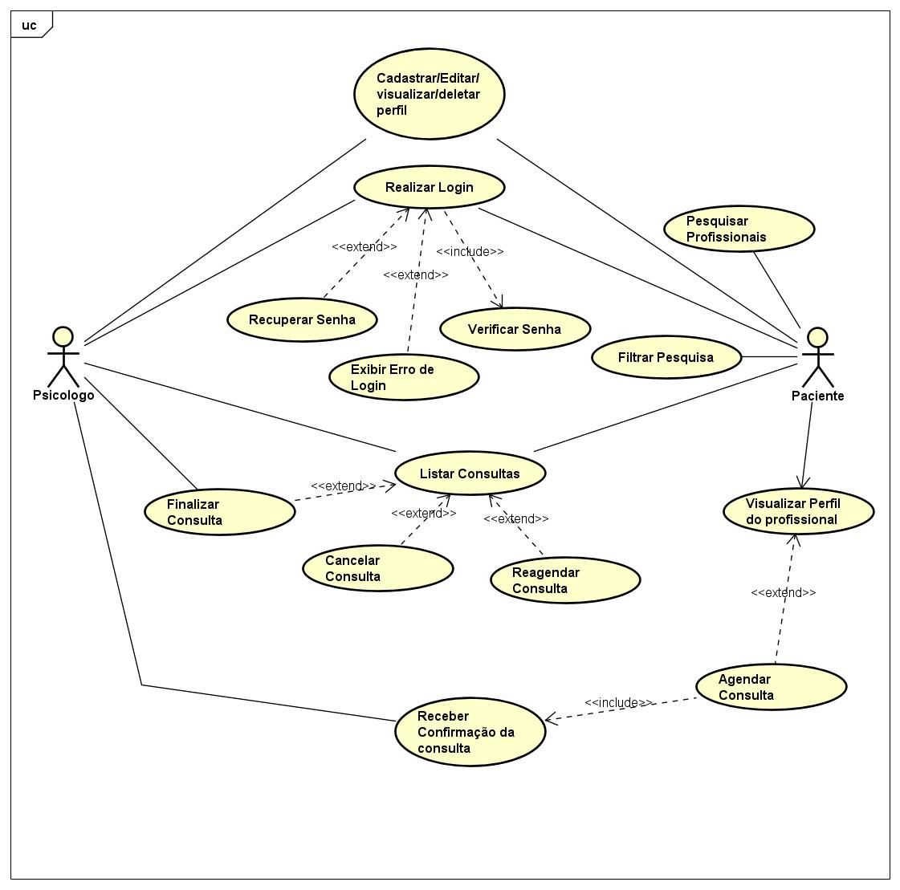

# Especificações do Projeto

Definição do problema e ideia de solução a partir da perspectiva do usuário. É composta pela definição do  diagrama de personas, histórias de usuários, requisitos funcionais e não funcionais além das restrições do projeto.

## Personas

Persona 1

Persona 2

Persona 3

Persona 4

Persona 5

## Histórias de Usuários

Com base na análise das personas forma identificadas as seguintes histórias de usuários:

## Requisitos

As tabelas que se seguem apresentam os requisitos funcionais e não funcionais que detalham o escopo do projeto.

### Requisitos Funcionais

| ID     | Descrição do Requisito                                                                                                                                                       | Prioridade |
|--------|------------------------------------------------------------------------------------------------------------------------------------------------------------------------------|------------|
| RF-001 | O sistema deve permitir o cadastro do usuário (tutor) incluindo dados como nome, e-mail, telefone e senha e outras informações essenciais para identificação e autenticação. | ALTA       | 
| RF-002 | O sistema deve enviar um e-mail de confirmação após cadastro para garantir a autenticidade dos usuários.                                                                     | ALTA       |
| RF-003 | O sistema deve permitir que os usuários consigam logar na aplicação com e-mail e senha e em seguida ter acesso ao seu perfil onde poderá cadastrar seu(s) Pet(s).            | ALTA       |
| RF-004 | O sistema deve permitir que os usuários recuperem sua senha por meio do e-mail em casos de esquecimento ou outro pertinente.                                                 | ALTA       |
| RF-005 | O sistema deve permitir que o usuário registre eventos relacionados ao Pet a data consulta veterinária, medicações administradas e outras informações relevantes.            | ALTA       |
| RF-006 | O sistema deve permitir que o usuário faça anotações sobre seu Pet como alergias, intolerâncias alimentares, reações selecionando o nível de leve, mediano ou agressivo.     | MÉDIA      |
| RF-007 | O sistema deve permitir que o usuário insira o histórico de vacinas do seu Pet.                                                                                              | MÉDIA      |
| RF-008 | O sistema de permitir que o usuário possa cadastrar eventos de suplementações e medicações com a opção de temporário ou contínuo.                                            | MÉDIA      |
| RF-009 | O sistema deve permitir cadastrar eventos como consultas agendadas e oferecer as opções de realizada, cancelada ou adiada.                                                   | MÉDIA      |
| RF-010 | O sistema deve oferecer notificações ou lembretes sobre datas e eventos importantes.                                                                                         | MÉDIA      |

### Requisitos não Funcionais

| ID      | Descrição do Requisito                                                                                  | Prioridade |
|---------|---------------------------------------------------------------------------------------------------------|------------|
| RNF-001 | O sistema deve funcionar em plataformas web e mobile.                                                   | ALTA       | 
| RNF-002 | As informações do perfil do Pet devem estar disponíveis apenas para seus respectivos tutores.           | ALTA       | 
| RNF-003 | O sistema deve fornecer um texto breve de informação nas caixas de diálogo que o usuário irá preencher. | ALTA       |
| RNF-004 | O sistema deve descrever os termos de política e privacidade da aplicação.                              | MÉDIA      |
| RNF-005 | O sistema deve apresentar acessibilidade.                                                               | MÉDIA      |
| RNF-006 | O sistema deve permitir as dúvidas mais frequentes relacionadas ao uso do aplicativo.                   | BAIXA      |

Com base nas Histórias de Usuário, enumere os requisitos da sua solução. Classifique esses requisitos em dois grupos:

- [Requisitos Funcionais
 (RF)](https://pt.wikipedia.org/wiki/Requisito_funcional):
 correspondem a uma funcionalidade que deve estar presente na
  plataforma (ex: cadastro de usuário).
- [Requisitos Não Funcionais
  (RNF)](https://pt.wikipedia.org/wiki/Requisito_n%C3%A3o_funcional):
  correspondem a uma característica técnica, seja de usabilidade,
  desempenho, confiabilidade, segurança ou outro (ex: suporte a
  dispositivos iOS e Android).
Lembre-se que cada requisito deve corresponder à uma e somente uma
característica alvo da sua solução. Além disso, certifique-se de que
todos os aspectos capturados nas Histórias de Usuário foram cobertos.

## Restrições

O projeto está restrito pelos itens apresentados na tabela a seguir.

|ID| Restrição                                                                                                                                                            |
|--|----------------------------------------------------------------------------------------------------------------------------------------------------------------------|
|01| O projeto deverá ser entregue até o final do semestre.                                                                                                               |
|02| O backend do sistema deve ser implementado na linguagem C# (.net) e o frontend do sistema deve ser processado no padrão dos navegadores web (Javascript, HTML, CSS). |

Enumere as restrições à sua solução. Lembre-se de que as restrições geralmente limitam a solução candidata.

> **Links Úteis**:
> - [O que são Requisitos Funcionais e Requisitos Não Funcionais?](https://codificar.com.br/requisitos-funcionais-nao-funcionais/)
> - [O que são requisitos funcionais e requisitos não funcionais?](https://analisederequisitos.com.br/requisitos-funcionais-e-requisitos-nao-funcionais-o-que-sao/)

## Diagrama de Casos de Uso

> **Links Úteis**:
> - [Criando Casos de Uso](https://www.ibm.com/docs/pt-br/elm/6.0?topic=requirements-creating-use-cases)
> - [Como Criar Diagrama de Caso de Uso: Tutorial Passo a Passo](https://gitmind.com/pt/fazer-diagrama-de-caso-uso.html/)
> - [Lucidchart](https://www.lucidchart.com/)
> - [Astah](https://astah.net/)
> - [Diagrams](https://app.diagrams.net/)
